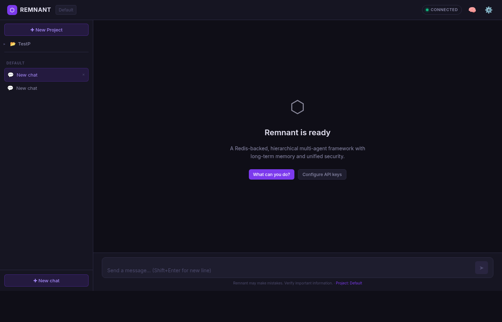

<div align="center">



<br/>
<br/>

# ⬡ Remnant

**A Docker-first, Redis-backed, hierarchical multi-agent AI framework with persistent memory, enterprise-grade security, and native multi-channel support.**

[](https://python.org)
[](https://fastapi.tiangolo.com)
[](https://redis.io/docs/stack/)
[](LICENSE)

</div>

---

## What is Remnant?

Remnant is a self-hostable AI agent framework built around three principles:

- **Remember everything.** Every conversation, decision, and piece of knowledge is indexed in a vector store and recalled automatically. Memories decay intelligently unless the curator marks them as important.
- **Run anywhere.** One `docker compose up` is all it takes. Connects to Anthropic, OpenAI, OpenRouter, or a local Ollama instance — switchable live from the UI.
- **Stay secure.** Injection detection, prompt redaction, AES-256-GCM encrypted secrets, and per-tool policies protect both the agent and your infrastructure.

---

## Feature Overview

| Capability | Details |
|---|---|
| **Persistent Memory** | HNSW vector index (Redis Stack) + Markdown source-of-truth. Auto-recall per request. Adaptive TTL via Curator. |
| **LLM Flexibility** | Anthropic Claude, OpenAI, OpenRouter (300+ models), Ollama — hot-swappable from the UI, no restart needed |
| **Multi-Agent** | Hierarchical agent graph with foreground/background lanes, parallel sub-task decomposition, configurable depth |
| **Agentic Loop** | Up to 5 rounds of LLM → tool-call → inject per request. JSON, `<tool_call>`, and `<tool>` XML formats supported |
| **Security** | Injection detection, prompt redaction, tool policies, AES-256-GCM secrets, per-attempt Redis audit log |
| **Budget Control** | Per-project, per-use-case daily/hourly token + cost caps with soft warnings and hard stops |
| **Multi-Channel** | WebSocket, REST/SSE, Telegram, WhatsApp QR, CLI, MCP SSE (Claude Code compatible) |
| **Tools & Skills** | Memory, web search, HTTP client, code execution, filesystem, shell, n8n, Telegram/WhatsApp send, config |
| **Curator Agent** | LLM-based importance scoring → adaptive TTL: `GLOBAL_HIGH` (no expiry) / `PROJECT_HIGH` (1 yr) / `EPHEMERAL` (7 d) |
| **Compaction** | Nightly LLM-driven compaction summarises low-score chunks; durable facts promoted to permanent memory |
| **MCP Server** | JSON-RPC 2.0 server + SSE streaming — plug Remnant's memory and agents into Claude Code |
| **Web UI** | Dark-theme, project-aware chat with streaming responses, model configuration, memory browser, usage dashboard |

---

## Architecture

```
┌──────────────────────────────────────────────────────────────────┐
│                          Channels                                │
│   Web UI (WS/SSE) │ Telegram │ WhatsApp QR │ CLI │ MCP │ API    │
└────────────────────────────┬─────────────────────────────────────┘
                             │ ChannelGateway
                             ▼
                  ┌─────────────────────┐
                  │     Orchestrator    │
                  │  (Conductor + Lanes)│
                  └──────────┬──────────┘
            ┌────────────────┼────────────────┐
       Foreground        Background        Sub-tasks
        Lane               Lane          (parallel)
            └────────────────┼────────────────┘
                             ▼
          ┌──────────────────────────────────────┐
          │            AgentRuntime              │
          │  RECALL → PLAN → LLM → TOOLS         │
          │         → RECORD → CURATE            │
          └───────┬──────────────────┬───────────┘
                  │                  │
        ┌─────────▼──────┐  ┌────────▼────────┐
        │  Memory Stack  │  │   LLM Stack     │
        │  HNSW (Redis)  │  │  + Budget Mgr   │
        │  Chunker/Embed │  │  Anthropic      │
        │  Curator/Compac│  │  OpenAI/Router  │
        └────────────────┘  │  Ollama (local) │
                            └─────────────────┘
```

---

## Quickstart

### Docker (recommended)

```bash
git clone <repo> remnant && cd remnant
cp .env.example .env
# Edit .env — set at least one LLM key (OPENROUTER_API_KEY is free)
docker compose up -d
```

Open **http://localhost:8000** — the setup wizard guides you through the rest.

### Optional services

```bash
# Add WhatsApp QR bridge
docker compose --profile whatsapp up -d

# Add local Ollama LLM server
docker compose --profile ollama up -d

# All services
docker compose --profile whatsapp --profile ollama up -d
```

### Local development

```bash
python3.11 -m venv .venv && source .venv/bin/activate
pip install -r requirements.txt
cp .env.example .env
uvicorn api.main:app --reload
```

```bash
# Run tests (no Redis needed — all mocked)
pytest tests/ -v
```

---

## Configuration

Six YAML files control every aspect of Remnant. All support `${ENV_VAR:default}` interpolation.

| File | Purpose |
|---|---|
| `config/remnant.yaml` | Redis, embedding model, vector index params, retrieval policy, chunking, compaction schedule |
| `config/llm_providers.yaml` | Provider registry — API keys, base URLs, per-model cost/context/vision metadata, use-case defaults |
| `config/budget.yaml` | Global + per-project + per-use-case token/cost caps, fallback chains |
| `config/security.yaml` | Injection patterns, redaction rules, tool policies, blocked-attempt log settings |
| `config/agents.yaml` | Agent definitions, system prompts, channel→agent routing table |
| `config/projects.yaml` | Project templates, planning wizard questions, MCP integration flags |

---

## LLM Providers

Remnant ships pre-configured for all major providers. Switch models live from the **Settings → Models** tab — no restart required.

| Provider | Models | Notes |
|---|---|---|
| **Anthropic** | claude-opus-4-6, claude-sonnet-4-6, claude-haiku-4-5 | 200K context, vision |
| **OpenRouter** | 300+ models including free tiers | stepfun/step-3.5-flash is the free default |
| **OpenAI** | gpt-4o, gpt-4o-mini, text-embedding-3-small | Vision + embeddings |
| **Ollama** | Any locally installed model | Configure URL in Settings UI |

Model selection is per use-case: `chat`, `planning`, `curator`, `compaction`, `fast`, `embedding` — each can use a different model.

---

## Memory System

Remnant's memory is a first-class citizen, not an afterthought.

```
User message
    │
    ▼
RECALL — vector search (HNSW cosine, 384 dims)
    │      ↳ reinforcement weighting: score × sigmoid(useful_score)
    │      ↳ tag filters: project_id, chunk_type
    │
    ▼
AgentRuntime injects retrieved context into system prompt
    │
    ▼
RECORD — new response chunked → embedded → Redis
    │      ↳ Markdown source-of-truth updated
    │
    ▼
CURATE (async) — LLM scores importance
    ├── GLOBAL_HIGH  → no TTL expiry
    ├── PROJECT_HIGH → 1-year TTL
    └── EPHEMERAL    → 7-day TTL

COMPACT (nightly 03:00 UTC)
    └── Low-score chunks → LLM summary → durable facts → MEMORY.md
```

**Embedding options:** sentence-transformers `all-MiniLM-L6-v2` (local, 384 dims, default) · Ollama `nomic-embed-text` · OpenAI `text-embedding-3-small`

---

## Agent Tools

Tools are security-checked against per-project policies before execution.

| Tool | Purpose |
|---|---|
| `memory_retrieve` | Vector similarity search over the knowledge base |
| `memory_record` | Store new facts with type tagging and TTL assignment |
| `web_search` | DuckDuckGo instant answers |
| `http_client` | General HTTP requests to external APIs or webhooks |
| `filesystem` | Read/write files within configured allowed paths |
| `code_exec` | Sandboxed Python / JavaScript / Bash execution |
| `shell` | Direct shell commands (confirmation required) |
| `n8n` | Trigger n8n automation workflows via webhook |
| `telegram_send` | Send messages via the connected Telegram bot |
| `whatsapp_send` | Send WhatsApp messages via the QR bridge |
| `mcp_bridge` | Call Claude Code MCP tools from within an agent |
| `config` | Agent self-management: list models, switch LLM at runtime, reload config |

Skills wrap tools in YAML and support Agent Zero and OpenClaw import formats.

---

## Channels

| Channel | How to use |
|---|---|
| **Web UI** | http://localhost:8000 — project-scoped streaming chat, memory browser, settings |
| **REST / SSE** | `POST /api/chat` — stream responses via Server-Sent Events |
| **WebSocket** | `ws://host/api/ws` — bidirectional frames, used by the Web UI |
| **Telegram** | Set `TELEGRAM_BOT_TOKEN` in Settings → your bot responds to DMs |
| **WhatsApp** | `docker compose --profile whatsapp up -d` → scan QR at `/api/whatsapp/qr` |
| **CLI** | `python -m remnant serve` then `python -m remnant.cli` for a local REPL |
| **MCP (Claude Code)** | Add `http://localhost:8000/mcp` to your Claude Code MCP config |

---

## MCP Integration

Remnant acts as an MCP server, making its memory and agents available to Claude Code and other MCP clients.

```json
{
  "mcpServers": {
    "remnant": {
      "url": "http://localhost:8000/mcp",
      "transport": "http"
    }
  }
}
```

**Exposed tools:** `memory_retrieve` · `memory_record` · `agent_run` · `skill_execute`

Remnant can also act as an MCP **client** — agents can dispatch tasks to Claude Code via the `mcp_bridge` tool, and projects with MCP enabled can send development tasks directly to Claude Code via `POST /api/projects/{id}/claude-code-task`.

---

## Security

| Layer | Implementation |
|---|---|
| **Injection detection** | 20+ blocked literal patterns + suspicious keyword concentration (≥3 of: execute, shell, admin, sudo, bypass, …) |
| **Prompt redaction** | API keys (OpenAI, Anthropic, GitHub), passwords, and secrets stripped from user input before LLM call |
| **Tool policies** | Default-deny; global allow-list + per-project overrides; confirmation required for shell, code_exec, filesystem_write |
| **Encrypted secrets** | AES-256-GCM via `cryptography.hazmat`, 96-bit random nonce, Redis-backed, keyed by `REMNANT_MASTER_KEY` |
| **Memory sanitisation** | Retrieved chunks re-checked through `is_safe()` before injection into system prompt |
| **Audit log** | Every blocked attempt written to Redis (`security:blocked:*`, 30-day TTL), viewable at `GET /api/admin/security/blocked` |

---

## API Reference

<details>
<summary><strong>Chat & WebSocket</strong></summary>

| Method | Path | Description |
|---|---|---|
| `POST` | `/api/chat` | Streaming SSE chat. Body: `{message, project_id?, session_id?}` |
| `WS` | `/api/ws` | WebSocket bidirectional chat |

</details>

<details>
<summary><strong>Memory</strong></summary>

| Method | Path | Description |
|---|---|---|
| `POST` | `/api/memory/search` | Vector similarity search |
| `POST` | `/api/memory/record` | Store a new memory chunk |
| `GET` | `/api/memory/stats` | Index statistics |
| `GET` | `/api/memory/recent` | Recently accessed chunks |
| `GET/PUT` | `/api/memory/file` | Read or write Markdown memory files |
| `DELETE` | `/api/memory/chunk/{id}` | Remove a chunk |

</details>

<details>
<summary><strong>LLM & Providers</strong></summary>

| Method | Path | Description |
|---|---|---|
| `GET` | `/api/llm/providers` | All registered model specs |
| `GET` | `/api/llm/providers/{use_case}` | Resolved model for a use-case |
| `GET` | `/api/llm/providers/remote/{provider}` | Live model list from provider API |
| `POST` | `/api/llm/providers/model-config` | Save model settings + hot-reload registry |
| `GET` | `/api/llm/usage` | Current token and cost counters |
| `GET` | `/api/llm/costs/breakdown` | Per-model cost breakdown for today |

</details>

<details>
<summary><strong>Settings</strong></summary>

| Method | Path | Description |
|---|---|---|
| `GET` | `/api/settings` | Current settings (key presence only, no values returned) |
| `POST` | `/api/settings/api-key` | Save an API key to `.env` + live environment |
| `POST` | `/api/settings/model` | Set and persist the default chat model |
| `POST` | `/api/settings/ollama` | Save Ollama URL + reload registry |
| `GET` | `/api/settings/ollama/test` | Ping Ollama and list available models |
| `POST` | `/api/settings/budget` | Update token/cost caps live + persist |

</details>

<details>
<summary><strong>Projects</strong></summary>

| Method | Path | Description |
|---|---|---|
| `GET/POST` | `/api/projects` | List or create projects |
| `GET/PUT/DELETE` | `/api/projects/{id}` | Read, update, or delete a project |
| `GET` | `/api/projects/{id}/stats` | Memory stats for a project |
| `POST` | `/api/projects/{id}/claude-code-task` | Dispatch a dev task to Claude Code via MCP |

</details>

<details>
<summary><strong>Admin</strong></summary>

| Method | Path | Description |
|---|---|---|
| `POST/GET/DELETE` | `/api/admin/secrets` | AES-256-GCM encrypted secret management |
| `POST` | `/api/admin/security/test` | Test a string against security rules |
| `GET` | `/api/admin/security/blocked` | Blocked-attempt audit log |
| `GET` | `/api/admin/agent-graph` | Live agent node+edge graph |
| `GET` | `/api/admin/lanes` | Lane worker status |
| `POST` | `/api/admin/compact` | Trigger manual memory compaction |

</details>

<details>
<summary><strong>WhatsApp & MCP</strong></summary>

| Method | Path | Description |
|---|---|---|
| `GET` | `/api/whatsapp/status` | Sidecar health + auth status |
| `GET` | `/api/whatsapp/qr` | QR code image (base64 data URL) |
| `POST` | `/api/whatsapp/start\|stop\|logout` | Container and session lifecycle |
| `POST` | `/mcp` | JSON-RPC 2.0 MCP server |
| `POST` | `/mcp/stream` | SSE streaming for `agent_run` |

</details>

---

## CLI

```bash
# Bootstrap directory structure
python -m remnant init

# Index all Markdown memory files into Redis
python -m remnant index [--project myproject] [--force]

# Vector similarity search
python -m remnant retrieve "what are my API preferences?" --project myproject

# Record a new memory
python -m remnant record "prefer async Python over threading" --type preference

# Start the server
python -m remnant serve

# Health check
python -m remnant health
```

---

## Budget & Cost Control

```yaml
# config/budget.yaml
global:
  max_cost_usd_per_day: 5.00
  max_tokens_per_day: 1_000_000
  max_tokens_per_hour: 500_000
  warn_at_fraction: 0.8        # warn at 80% of cap
  on_budget_exhausted: stop    # raises BudgetExceeded

per_project:
  max_cost_usd_per_day: 2.00
  max_tokens_per_day: 500_000

per_use_case:
  compaction: { max_cost_usd_per_run: 0.10 }
  curator:    { max_cost_usd_per_run: 0.05 }
  planning:   { max_cost_usd_per_session: 0.50 }
```

Caps update live via `POST /api/settings/budget` — no restart needed.

---

## Deployment

### Systemd service

```bash
sudo cp remnant.service /etc/systemd/system/
sudo systemctl enable --now remnant
```

### One-shot install script

```bash
bash install.sh
```

The service auto-restarts on crash. Logs are structured JSON for easy ingestion by Loki, Datadog, or any log aggregator.

### Environment variables

| Variable | Required | Description |
|---|---|---|
| `OPENROUTER_API_KEY` | Recommended | Access to 300+ free and paid models |
| `ANTHROPIC_API_KEY` | Optional | Claude Opus / Sonnet / Haiku |
| `OPENAI_API_KEY` | Optional | GPT-4o and OpenAI embeddings |
| `REMNANT_MASTER_KEY` | Recommended | Base64url-encoded 32-byte key for AES-256-GCM secrets |
| `OLLAMA_BASE_URL` | Optional | Default: `http://localhost:11434` |
| `REDIS_URL` | Optional | Default: `redis://redis:6379` |
| `TELEGRAM_BOT_TOKEN` | Optional | Enable Telegram channel |

---

## Project Structure

```
remnant/
├── api/                    # FastAPI routes and lifespan
│   ├── main.py             # App factory, singletons, startup
│   ├── mcp_endpoints.py    # MCP JSON-RPC 2.0 server
│   └── routes/             # chat, memory, llm, settings, projects, admin, whatsapp
├── channels/               # Channel adapters
│   ├── gateway.py          # Hub-and-spoke outbound router
│   ├── telegram_bot.py     # aiogram long-polling
│   ├── websocket_channel.py
│   └── whatsapp_qr.py
├── core/                   # Framework internals
│   ├── runtime.py          # RECALL → LLM → TOOLS → RECORD loop
│   ├── orchestrator.py     # Conductor, lane dispatch, decomposition
│   ├── planner.py          # LLM task decomposition + setup wizard
│   ├── agent_graph.py      # Hierarchical agent node graph
│   ├── lane_manager.py     # Per-session asyncio queues
│   ├── llm_client.py       # Unified LLM interface (Anthropic, OpenAI, Ollama)
│   ├── provider_registry.py# Model spec registry, hot-reload
│   ├── budget_manager.py   # Redis-backed token/cost caps
│   ├── security.py         # Injection, redaction, policies, secrets
│   ├── curator_agent.py    # Async importance scoring
│   ├── secrets_store.py    # AES-256-GCM secret storage
│   └── scheduling.py       # APScheduler: compaction, curator, cleanup
├── memory/                 # Memory stack
│   ├── redis_client.py     # Redis + HNSW index management
│   ├── embedding_provider.py # sentence-transformers / Ollama / OpenAI
│   ├── chunking.py         # Markdown-aware chunker
│   ├── memory_recorder.py  # Write pipeline: check → chunk → embed → store
│   ├── memory_retriever.py # KNN search with reinforcement weighting
│   ├── memory_compactor.py # Nightly LLM compaction
│   └── global_index.py     # Cross-project durable facts
├── tools/                  # Agent tools (BaseTool subclasses)
├── skills/                 # YAML skill wrappers
├── config/                 # YAML configuration files
├── webui/                  # Alpine.js dark-theme Web UI
├── whatsapp-sidecar/       # Node.js whatsapp-web.js bridge
├── tests/                  # 51 unit tests (all mocked, no Redis needed)
├── Dockerfile
└── docker-compose.yml      # Profiles: whatsapp, ollama
```

---

## License

MIT — see [LICENSE](LICENSE).
